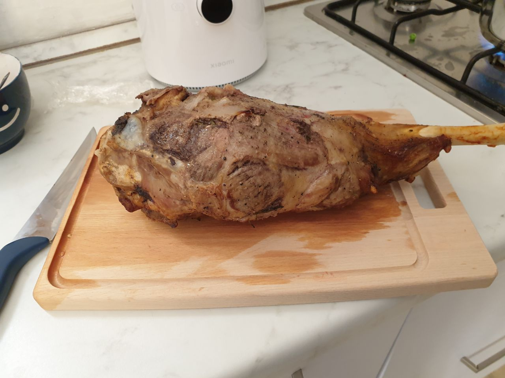
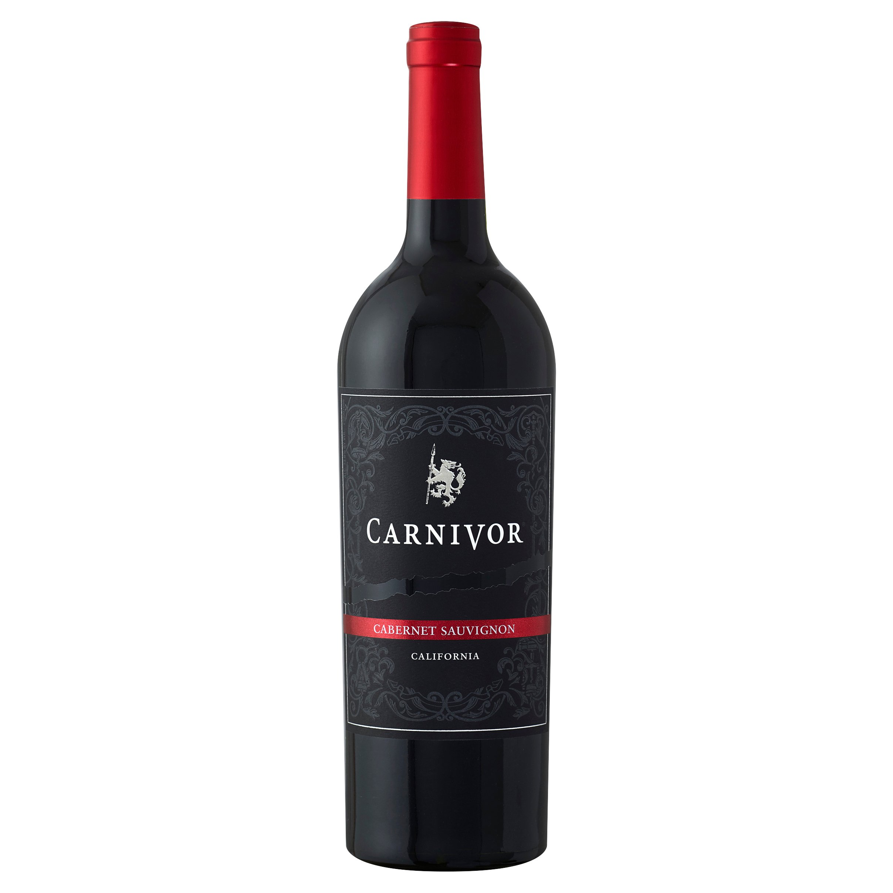
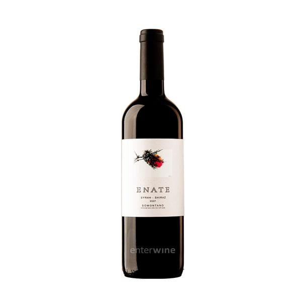
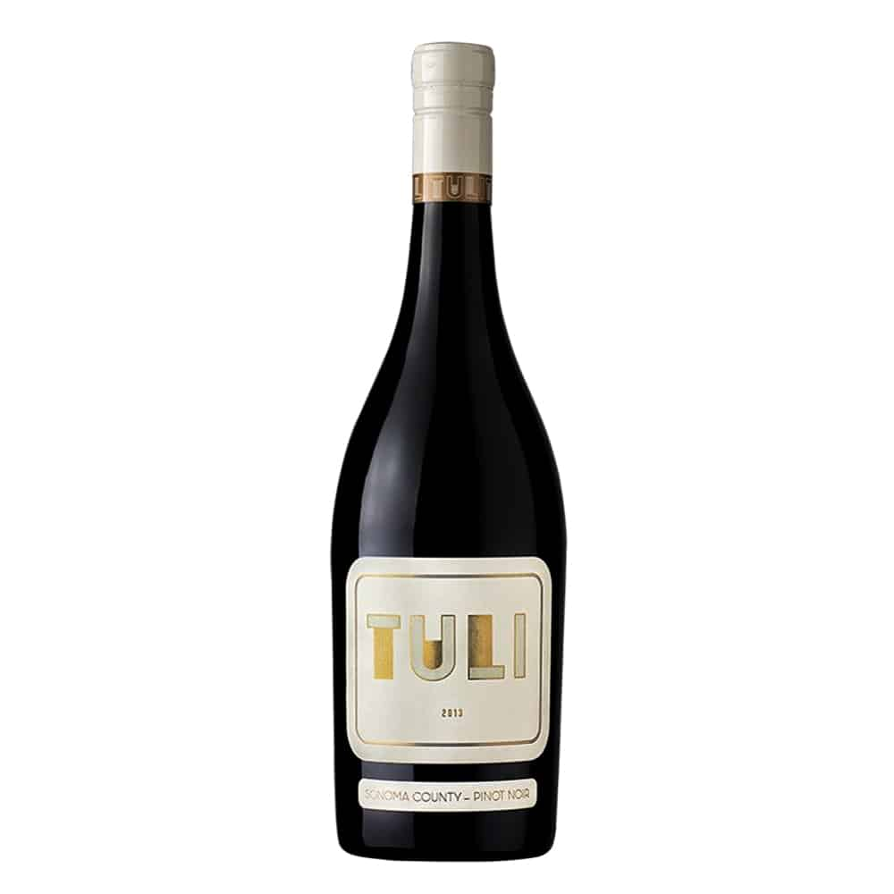
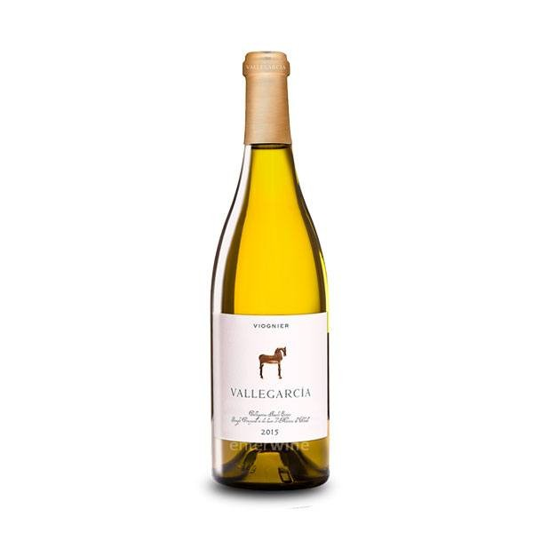
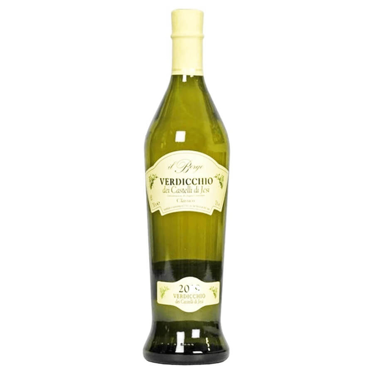

# `HTML Exercises`

[Return to main page](../README.md)

---

**Important Notes:**

1. There is a difference between an element and a tag.
   - An element contains a set of tags with attributes and their values.
   - A tag is a set of characters opening and closing an element.

Example:

```html
<a href="https://developer.mozilla.org/">Mozilla Developer Resources</a>
```

`<a></a>`- These are tags;  
`href` - This is an attribute;  
`"https://developer.mozilla.org/"` - this is the value of the attribute href;  
`<a href="https://developer.mozilla.org/">Mozilla Developer Resources</a>` - This is the entire element.

2. Tags can be both **container tags** and **self-closing tags**.

   - A container tag needs both opening and closing tags to enclose an element. The closing tag starts with a forward slash: `<p></p>`.
   - A self-closing tag doesn't contain an element so it doesn't need an opening or closing tag. It can simply be declared as a closing tag:

   ```html
   
   ```

In modern HTML5, you don't need the forward slash at the end of the self-closing tag (although it is still advisable). This is also valid in HTML5:

```html

```

3. Some attributes have values, some do not.

   - `src` in this example has a link as a value:

     ```html
     
     ```

   - In this example of an `a` element, the attribute `download` does not have a value, it just downloads the file when you click on it:

     ```html
     <a
       src="https://cdn.freecodecamp.org/curriculum/cat-photo-app/relaxing-cat.jpg"
       download
       >Download the image</a
     >
     ```

4. Attributes do not have an order, and can be in any order from left to right, but if you put them in alphabetical order it will be much easier to work out if you're missing any.

---

## `The Model Web Page`

These set of exercises are intended to consolidate the materials covered in [Basics of HTML Elements and Attributes](/html/html.md) by taking you gradually through the steps to recreate the model web page here: [Jamie Oliver's Roast Leg of Lamb](../webpage/index.html). All resources are in the [web page folder](../webpage/). You are welcome to make use of these resources to recreate this web or create your own web page with your own resources.

---

## `Question 1 - The DOCTYPE declaration`

Insert a DOCTYPE declaration at the beginning of your new index.html document.

Hints:

1. Emmet abbreviation: !!!

Solution:

```html
<!DOCTYPE html>
```

---

## `Question 2 - The html tag`

Insert an html tag into which to put the rest of the document.

Hints:

1. The <html> HTML element represents the root (top-level element) of an HTML document, so it is also referred to as the root element. All other elements must be descendants of this element.

Solution:

```html
<!DOCTYPE html>
<html></html>
```

---

## `Question 3 - The head tag`

Insert a head element at the top of your html element.

Hints:

1. The <head> HTML element contains machine-readable information (metadata) about the document, like its title, scripts, and style sheets.

Solution:

```html
<!DOCTYPE html>
<html>
  <head> </head>
</html>
```

---

## `Question 3 - The meta tag`

Insert two meta tags at the top of your head element. Add the following attributes with values in your meta tags:

1. 1st meta tag: charset="UTF-8";
1. 2nd meta tag: name="viewport" content="width=device-width, initial-scale=1.0"

Hints:

1. meta is a self-closing tag.

Solution:

```html
<!DOCTYPE html>
<html>
  <head>
    <meta charset="UTF-8" />
    <meta content="width=device-width, initial-scale=1.0" name="viewport" />
  </head>
</html>
```

---

## `Question 4 - The title tag`

Insert a title element under your meta tags. The title tag should contain the text: Roast Leg of Lamb.

Hints:

1. The title element sets the title of your web page in the title bar of the window.

Solution:

```html
<!DOCTYPE html>
<html lang="en">
  <head>
    <meta charset="UTF-8" />
    <meta content="width=device-width, initial-scale=1.0" />
    name="viewport"
    <title>Roast Leg of Lamb</title>
  </head>
</html>
```

---

## `Question 5 - The body tag`

Insert a body element under the head element.

Hints:

1. The body element represents the content of an HTML document. There can be only one body element in a document.

Solution:

```html
<!DOCTYPE html>
<html lang="en">
  <head>
    <meta charset="UTF-8" />
    <meta content="width=device-width, initial-scale=1.0" name="viewport" />
    <title>Roast Leg of Lamb</title>
  </head>
  <body></body>
</html>
```

---

## `Question 6 - Insert the initial boilerplate with an emmet declaration`

All the code you've inputted so far is common to virtually all html pages and is therefore called **boilerplate** that is a sort of template for further code. Delete all that you've done so far and recreate it all using an emmet declaration. Remember to fill the title element with the text in Question 4.

Hints:

1. The emmet declaration to insert the basic boilerplate of an html document is: !
1. Remember to change the content to the title element.

Solution:

```html
<!DOCTYPE html>
<html lang="en">
  <head>
    <meta charset="UTF-8" />
    <meta content="width=device-width, initial-scale=1.0" name="viewport" />
    <title>Roast Leg of Lamb</title>
  </head>
  <body></body>
</html>
```

## `Question 7 - Insert additional meta tags in the boilerplate code`

Your boilerplate code is missing a number of additional meta tags that are nice to have. Please insert the following meta tags with their values under the other meta tags in your boilerplate:

1. 1st meta tag: content="Jamie Oliver's recipe for a lamb of roast leg with amplifications" name="content";
1. 1st meta tag: content="your name" name="author" ;

Solution:

```html
<!DOCTYPE html>
<html lang="en">
  <head>
    <meta charset="UTF-8" />
    <meta content="width=device-width, initial-scale=1.0" name="viewport" />
    <meta
      content="Jamie Oliver's roast leg of lamb with some amplifications"
      name="content"
    />
    <!-- In the content attribute below, write your own name -->
    <meta content="" name="author" />
    <title>Roast Leg of Lamb</title>
  </head>
  <body></body>
</html>
```

---

## `Question 8 - Create and link your css file`

Create your css file in your root folder and link it in the head element just above the title element.

Hints:

1. Different operating systems have different ways of expressing the path. Make sure that the path in your link points correctly to your css file. This documentation was written on linux and the path format reflects the one on that OS.

Solution:

```html
<!DOCTYPE html>
<html lang="en">
  <head>
    <meta charset="UTF-8" />
    <meta content="width=device-width, initial-scale=1.0" name="viewport" />
    <meta
      content="Jamie Oliver's roast leg of lamb with some amplifications"
      name="content"
    />
    <!-- In the content attribute below, write your own name -->
    <meta content="" name="author" />
    <link href="/styles.css" rel="stylesheet" type="text/css" />
    <title>Roast Leg of Lamb</title>
  </head>
  <body></body>
</html>
```

---

## `Question 9 - Create and link your javascript file`

Create your javascript file in your root folder and link it in the head element just above the title element.

Hints:

1. Different operating systems have different ways of expressing the path. Make sure that the path in your link points correctly to your javascript file. This documentation was written on linux and the path format reflects the one on that OS.

Solution:

```html
<!DOCTYPE html>
<html lang="en">
  <head>
    <meta charset="UTF-8" />
    <meta content="width=device-width, initial-scale=1.0" name="viewport" />
    <meta
      content="Jamie Oliver's roast leg of lamb with some amplifications"
      name="content"
    />
    <!-- In the content attribute below, write your own name -->
    <meta content="" name="author" />
    <link href="/styles.css" rel="stylesheet" type="text/css" />
    <script src="script.js"></script>
    <title>Roast Leg of Lamb</title>
  </head>
  <body></body>
</html>
```

---

## `Question 10 - Insert a Main element`

At the top of your `<body>` element, insert a `<main>` element.

Solution:

```html
<body>
  <main></main>
</body>
```

---

## `Question 11 - Insert a Header Element`

At the top of your `<main>` element, insert a `<header>` element and inside it nest an `<h1>` element. Give your `<h1>` element a title such as "Roast Leg of Lamb by Jamie Oliver". This will be the main title of your web page.

Solution:

```html
<header>
  <h1>Roast Leg of Lamb by Jamie Oliver</h1>
</header>
```

---

## `Creating a Table`

In the next cluster of questions, you will create your first visual element of the page, which is a table. However you will not be using the `<table>` and its related elements for this task. Today, the `<table>` element is rather long in the tooth and a much better alternative is CSS Grid. The next cluster of elements that you will create will form a table once you style it appropriately using CSS Grid. You will do this in your CSS exercises.

---

### `Question 12 - Create a div`

Under the `<header>` element, create a `<div>` element. Give it a class name of "grid-container". In the div, nest a `<section>` element with a class name of "ingredients". "grid-containter" is the parent container of your grid, while "ingredient" is its first child element, the first cell in the two-celled row that our table will consist of.

Solution:

```html
<div class="grid-container">
  <section class="ingredient"></section>
</div>
```

---

### `Question 13 - Create h2 and ul elements`

In your section called ingredients nest a `<h2>` element and an unordered list. The `<h2>` element should contain the text "Ingredient:" while the unordered list should contain your list of ingredients.

```html
<h2>Ingredients:</h2>
<ul>
  <li>1 leg of lamb (2.4 kg)</li>
  <li>Garlic</li>
  <li>Rosemary</li>
  <li>Anchovy</li>
  <li>Olive oil</li>
  <li>Salt and pepper</li>
  <li>Carrot (chunky bits)</li>
  <li>Celery (a couple of stalks)</li>
  <li>Onions (a couple)</li>
</ul>
```

---

### `Question 14 - Create an img element`

Below your section called "ingredients" and inside the div called "grid-container" create an `` element with a class name of main-image. The src attribute should take the path of your roast lamb image (in the img folder). This `` element is the second cell of the table we are creating with CSS Grid.

Solution:

```html

```

---

### `Question 15 - Create a section`

Under your div called "grid-container", create a `<section>` element. In this section, create an `<h2>` element with the text "Preparation:". Under the `<h2>` element, create an ordered list with the following text:

1. It's essential to let the lamb come to room temperature before roasting. Do not move it directly from the fridge to the oven.
1. Take a small knife and stab the lamb evenly down to the bone, about 2.5 inches apart.
1. Use your finger to widen the holes.
1. Drizzle a bit of olive oil over the lamb.
1. Season with salt and pepper and rub it all over the lamb.
1. For each hole you've made, insert a small piece of garlic, rosemary, and half an anchovy.

Solution:

```html
<section>
  <h2>Preparation:</h2>
  <ol>
    <li>
      It's essential to let the lamb come to room temperature before roasting.
      Do not move it directly from the fridge to the oven.
    </li>
    <li>
      Take a small knife and stab the lamb evenly down to the bone, about 2.5
      inches apart.
    </li>
    <li>Use your finger to widen the holes.</li>
    <li>Drizzle a bit of olive oil over the lamb.</li>
    <li>Season with salt and pepper and rub it all over the lamb.</li>
    <li>
      For each hole you've made, insert a small piece of garlic, rosemary, and
      half an anchovy.
    </li>
  </ol>
</section>
```

---

### `Question 16 - Create a section`

Underneath the previous section, create another section. This section should contain an `<h2>` element with the text "Trivet Preparation:", and an ordered list with the following text:

1. In a roasting tray, add chunky bits of carrot, stalks of celery, and onions.
1. Add a glass of water to the tray. This will catch the juices from the lamb and can be used for gravy later.

Under this ordered list, create another `<h2>` element with the text "Alternatively:", and an ordered list with the following text:

1. Peel 1.5 kgs of russet potatoes and cut into 1/4-inch thick slices. Boil the potatoes in a pot with 1 kg sliced onions and 1.75 cups beef stock for 10 minutes.
1. Spread the half-boiled potatoes into a buttered roasting pan and season with salt and pepper.
1. Place the pan in the oven and bake for 10 minutes at 200 degrees C. Reduce the heat to 190 degrees C and add the marinated lamb on top of the potatoes. Roast until the lamb is done to your liking.

Solution:

```html
<section>
  <h2>Trivet Preparation:</h2>
  <ol>
    <li>
      In a roasting tray, add chunky bits of carrot, stalks of celery, and
      onions.
    </li>
    <li>
      Add a glass of water to the tray. This will catch the juices from the lamb
      and can be used for gravy later.
    </li>
  </ol>

  <h2>Alternatively:</h2>
  <ol>
    <li>
      Peel 1.5 kgs of russet potatoes and cut into 1/4-inch thick slices. Boil
      the potatoes in a pot with 1 kg sliced onions and 1.75 cups beef stock for
      10 minutes.
    </li>
    <li>
      Spread the half-boiled potatoes into a buttered roasting pan and season
      with salt and pepper.
    </li>
    <li>
      Place the pan in the oven and bake for 10 minutes at 200 degrees C. Reduce
      the heat to 190 degrees C and add the marinated lamb on top of the
      potatoes. Roast until the lamb is done to your liking.
    </li>
  </ol>
</section>
```

---

### `Question 17 - Create a section`

Underneath the previous section, create another section. This section should contain an `<h2>` element with the text "Roasting:", and an ordered list with the following text:

1. Preheat the oven to 220°C.
1. Place the leg of lamb directly onto the oven bars at the top.
1. Place the trivet/potato tray underneath the lamb.
1. As soon as the oven is closed, reduce the temperature to 180°C (350°F).
1. Roast the lamb using the techniques mentioned below.

Now create an `<h2>` element with the text "Roasting Techniques:", and an ordered list with the following text:

1. For Medium Rare: Roast for approximately 1 hour and 10 minutes. The internal temperature should be around 63°C (145°F). This will give you a pinkish hue in the meat.
1. For Medium/Blushing: This method provides a nice balance. The meat from the ends will be more well-done, while the inside will be blushing and juicy. The internal temperature should be: 70°C to 75°C (158°F to 167°F).
1. For Well-Done: Roast for about 2 hours and 10 minutes. The internal temperature should reach 83°C (181°F). This method is embraced by many cultures and offers deeper flavors and more gnarliness from the skin and fat. The meat is cooked through but remains juicy.

Finally create an `<h2>` element with the text "Resting:", and an ordered list with the following text:

1. Once roasted, let the lamb rest for at least half an hour. This allows the heat to continue penetrating the lamb, ensuring it's cooked evenly.
1. Resting the lamb after roasting is crucial for juiciness and even cooking.

Solution:

```html
<section>
  <h2>Roasting:</h2>
  <ol>
    <li>Preheat the oven to 220°C.</li>
    <li>Place the leg of lamb directly onto the oven bars at the top.</li>
    <li>Place the trivet/potato tray underneath the lamb.</li>
    <li>
      As soon as the oven is closed, reduce the temperature to 180°C (350°F).
    </li>
    <li>Roast the lamb using the techniques mentioned below.</li>
  </ol>

  <h2>Roasting Techniques:</h2>
  <ol>
    <li>
      For Medium Rare: Roast for approximately 1 hour and 10 minutes. The
      internal temperature should be around 63°C (145°F). This will give you a
      pinkish hue in the meat.
    </li>
    <li>
      For Medium/Blushing: This method provides a nice balance. The meat from
      the ends will be more well-done, while the inside will be blushing and
      juicy. The internal temperature should be: 70°C to 75°C (158°F to 167°F).
    </li>
    <li>
      For Well-Done: Roast for about 2 hours and 10 minutes. The internal
      temperature should reach 83°C (181°F). This method is embraced by many
      cultures and offers deeper flavors and more gnarliness from the skin and
      fat. The meat is cooked through but remains juicy.
    </li>
  </ol>

  <h2>Resting:</h2>
  <ol>
    <li>
      Once roasted, let the lamb rest for at least half an hour. This allows the
      heat to continue penetrating the lamb, ensuring it's cooked evenly.
    </li>
    <li>
      Resting the lamb after roasting is crucial for juiciness and even cooking.
    </li>
  </ol>
</section>
```

---

### `Question 18 - Create a section`

Underneath the previous section, create another section. This section should contain an `<h2>` element with the text "Serving Suggestions:", and an ordered list with the following text:

1. In the summer, pair the pink-cooked lamb with asparagus, peas, and spinach.
1. For the well-done lamb, consider adding flavors like fennel seeds, coriander seeds, thyme, and garlic. Spice rubs can enhance the taste.

Under this ordered list, create another `<h2>`image with the text "Carving:" with the following **unordered** list:

- Use a sharp, long carving knife for best results. Make long carving movements through the lamb.

Now create another `<h2>`image with the text "Suggested Improvements:" with the following ordered list:

1. For added flavor, consider marinating the lamb in a mixture of olive oil, minced garlic, chopped rosemary, and crushed anchovies for a few hours before roasting.
1. To ensure even cooking, consider using a meat thermometer to check the internal temperature of the lamb.

Solution:

```html
<section>
  <h2>Serving Suggestions:</h2>
  <ol>
    <li>
      In the summer, pair the pink-cooked lamb with asparagus, peas, and
      spinach.
    </li>
    <li>
      For the well-done lamb, consider adding flavors like fennel seeds,
      coriander seeds, thyme, and garlic. Spice rubs can enhance the taste.
    </li>
  </ol>

  <h2>Carving:</h2>
  <ul>
    <li>
      Use a sharp, long carving knife for best results. Make long carving
      movements through the lamb.
    </li>
  </ul>

  <h2>Suggested Improvements:</h2>
  <ol>
    <li>
      For added flavor, consider marinating the lamb in a mixture of olive oil,
      minced garlic, chopped rosemary, and crushed anchovies for a few hours
      before roasting.
    </li>
    <li>
      To ensure even cooking, consider using a meat thermometer to check the
      internal temperature of the lamb.
    </li>
  </ol>
</section>
```

---

### `Question 19 - Create a section`

Create another section, within it create an `<h2>` element with the text "Wine Pairing Suggestions:".

Solution:

```html
<section>
  <h2>Wine Pairing Suggestions:</h2>
</section>
```

---

### `Question 20 - Create a section`

In the section in Question 19, create a `<div>` element with a classname of wine-flex.

Solution:

```html
<section>
  <h2>Wine Pairing Suggestions:</h2>
  <div class="wine-flex"></div>
</section>
```

---

### `Question 21 - Create a Wine Card`

In the div in Question 20, create a `<div>` element with a classname of wine-card and an id of "wine1". In this div, create a `<figure>` element. In figure, create an `` element. The src attribute should take the path of your Cabernet Sauvignon image (in the img folder). Give it an alt of Cabernet Sauvignon. Below, give it a `<figcaption>` of Cabernet Sauvignon.

Solution:

```html
<section>
  <h2>Wine Pairing Suggestions:</h2>
  <div class="wine-flex">
    <div class="wine-card" id="wine1">
      <figure>
        
        <figcaption>Cabernet Sauvignon</figcaption>
      </figure>
    </div>
  </div>
</section>
```

---

### `Question 21 - Create the other Wine Cards`

Repeat this for all the wine images in the img folder. Remember to give them an id of wine2, wine3, etc.

Solution:

```html
<section>
  <h2>Wine Pairing Suggestions:</h2>
  <div class="wine-flex">
    <div class="wine-card" id="wine1">
      <figure>
        
        <figcaption>Cabernet Sauvignon</figcaption>
      </figure>
    </div>
    <div class="wine-card" id="wine2">
      <figure>
        
        <figcaption>Syrah</figcaption>
      </figure>
    </div>
    <div class="wine-card" id="wine3">
      <figure>
        
        <figcaption>Pinot Noir</figcaption>
      </figure>
    </div>
    <div class="wine-card" id="wine4">
      <figure>
        
        <figcaption>Chardonnay</figcaption>
      </figure>
    </div>
    <div class="wine-card" id="wine5">
      <figure>
        
        <figcaption>Viognier</figcaption>
      </figure>
    </div>
    <div class="wine-card" id="wine6">
      <figure>
        
        <figcaption>Verdicchio</figcaption>
      </figure>
    </div>
  </div>
</section>
```
